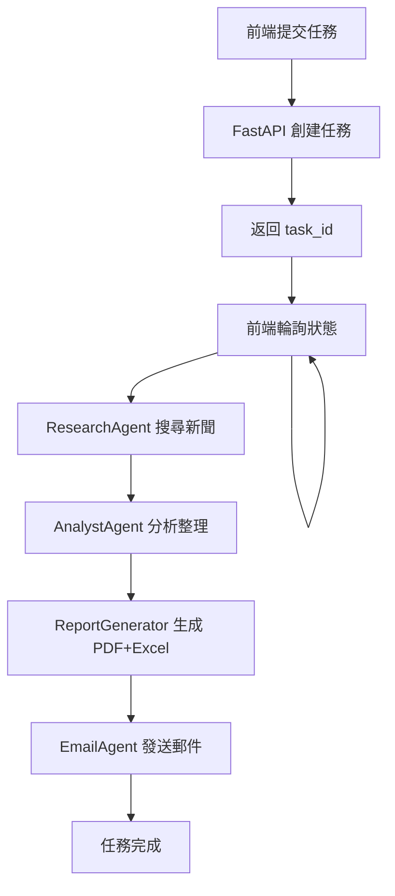

# 🌏 東南亞金融新聞智能搜尋與報告系統

基於 **FastAPI** 的前後端分離架構，提供自動化新聞搜尋、分析、報告生成和郵件發送的 RESTful API 服務。

## 📋 功能特色

- 🔍 **智能搜尋**: 使用 OpenAI GPT 自動解析需求並執行網路搜尋
- 📊 **自動分析**: 將搜尋結果結構化並整理成專業報告
- 📄 **雙格式報告**: 自動生成 PDF 和 Excel 格式報告
- 📧 **郵件寄送**: 透過 SMTP 自動發送報告至指定郵箱
- 🚀 **RESTful API**: 完整的後端 API，支援任務創建和狀態查詢
- 🌐 **前後端分離**: 簡易前端 + 完整 API 文件，方便前端整合

## 🏗️ 技術架構

### 核心技術棧
- **後端框架**: FastAPI 0.109.0+
- **Web 伺服器**: Uvicorn (ASGI)
- **語言**: Python 3.11+
- **套件管理**: pip
- **前端**: 簡易 HTML（public/index.html）+ 完整 API 供自訂前端使用
- **PDF 生成**: ReportLab
- **Excel 生成**: Pandas + openpyxl
- **AI 模型**: OpenAI GPT-5 (gpt-5-2025-08-07)
- **搜尋引擎**: DuckDuckGo
- **郵件服務**: SMTP (Gmail)

### Agent 架構
```
NewsReportWorkflow
├── ResearchAgent        # 搜尋代理（DuckDuckGo）
├── AnalystAgent         # 分析代理（GPT-5）
├── ReportGeneratorAgent # 報告生成代理（PDF + Excel）
└── EmailAgent           # 郵件代理（SMTP）
```

### API 架構
```
FastAPI Backend
├── /api/tasks/news-report (POST)  # 創建新聞搜尋任務
├── /api/tasks/{task_id} (GET)     # 查詢任務狀態
└── /health (GET)                  # 健康檢查
```

## 🚀 快速開始

### 前置需求
- Python 3.11 或更高版本
- Git（選用）

### 安裝步驟

1. **克隆專案**
```bash
git clone <repository-url>
cd SEANewsAlert
```

2. **配置環境變數**

複製 `.env.example` 並重命名為 `.env`，填入必要資訊：
```env
OPENAI_API_KEY=your_openai_api_key
SMTP_SERVER=smtp.gmail.com
SMTP_PORT=587
EMAIL_ADDRESS=your_email@gmail.com
EMAIL_PASSWORD=your_app_password
```

> ⚠️ **Gmail 使用者**：請使用「應用程式密碼」，不是普通密碼
> 設定路徑：Google 帳戶 → 安全性 → 兩步驟驗證 → 應用程式密碼

3. **安裝依賴並啟動服務**

**方式 1: 一鍵啟動（推薦）**
```bash
# Windows
START-ALL.bat

# 會自動：
# 1. 檢查並安裝所需套件
# 2. 啟動 FastAPI 服務
# 3. 在瀏覽器開啟測試頁面
```

**方式 2: 手動啟動**
```bash
# 安裝依賴
pip install -r requirements-api.txt

# 啟動服務
START-FAST.bat
# 或
python -m uvicorn app.main:app --host 127.0.0.1 --port 8000
```

4. **驗證安裝**

瀏覽器開啟：
- API 文件：http://127.0.0.1:8000/docs
- 測試前端：http://127.0.0.1:8000/static/index.html
- 健康檢查：http://127.0.0.1:8000/health

## 💻 使用方式

### 方式 1: 測試前端（快速體驗）

1. 啟動服務後，開啟 http://127.0.0.1:8000/static/index.html
2. 輸入搜尋需求（例如：搜尋新加坡金融科技最新發展，要英文新聞）
3. 輸入接收郵箱
4. 點擊「開始搜尋」
5. 即時查看進度（自動輪詢）
6. 完成後報告會自動發送到郵箱

### 方式 2: API 整合（前端開發）

查看 **[FRONTEND_API.md](./FRONTEND_API.md)** 了解完整 API 文件。

**核心 2 個 API：**

```javascript
// 1. 創建任務
const response = await fetch('http://127.0.0.1:8000/api/tasks/news-report', {
  method: 'POST',
  headers: { 'Content-Type': 'application/json' },
  body: JSON.stringify({
    user_prompt: '搜尋新加坡金融新聞',
    email: 'user@example.com'
  })
});
const { task_id } = await response.json();

// 2. 輪詢狀態（每 2 秒）
const status = await fetch(`http://127.0.0.1:8000/api/tasks/${task_id}`);
const data = await status.json();
console.log(`進度: ${data.progress}% - ${data.step_message}`);
```

### 方式 3: Swagger UI（API 測試）

開啟 http://127.0.0.1:8000/docs 直接測試 API。

## 📁 專案結構

```
SEANewsAlert/
├── app/                        # FastAPI 後端應用
│   ├── main.py                 # FastAPI 主程式
│   ├── routers/                # API 路由
│   │   └── tasks.py            # 任務相關 API
│   └── services/               # 業務邏輯
│       ├── progress.py         # 任務狀態管理
│       └── workflow.py         # 工作流程編排
├── agents/                     # Agent 模組
│   ├── research_agent.py       # 搜尋代理
│   ├── analyst_agent.py        # 分析代理
│   ├── report_agent.py         # 報告生成代理
│   └── email_agent.py          # 郵件代理
├── public/                     # 前端靜態文件
│   └── index.html              # 測試用前端頁面
├── reports/                    # 生成的報告（PDF + Excel）
├── templates/                  # 報告模板
├── docs/                       # 技術文件
│   ├── ARCHITECTURE.md         # 架構說明
│   └── SYSTEM_FLOW.md          # 系統流程
├── utils/                      # 工具函數
├── workflow.py                 # 工作流程（給 agents 使用）
├── config.py                   # 配置管理
├── .env                        # 環境變數（不提交）
├── .env.example                # 環境變數範例
├── requirements-api.txt        # Python 依賴
├── pyproject.toml              # 專案配置
├── START-FAST.bat              # 快速啟動腳本（推薦）
├── START-ALL.bat               # 一鍵安裝並啟動
├── REBUILD-VENV.bat            # 重建虛擬環境
├── README.md                   # 📖 專案說明（本文件）
├── FRONTEND_API.md             # 📘 前端 API 文件
├── PRD.md                      # 📋 產品需求文件
├── HOW_TO_START.md             # 🚀 啟動指南
└── TROUBLESHOOTING.md          # 🔧 故障排除
```

## 🎯 工作流程



### 詳細步驟

1. **需求解析 (Workflow.parse_prompt)**
   - 使用 GPT-5 自動解析使用者輸入
   - 提取語言、時間範圍、新聞數量等參數
   - 進度：0-24%

2. **網路搜尋 (ResearchAgent)**
   - 使用 DuckDuckGo 進行網路搜尋
   - 根據解析結果搜尋 5-15 條新聞
   - 記錄標題、來源、網址
   - 進度：25-49%

3. **資訊分析 (AnalystAgent)**
   - 使用 GPT-5 整理搜尋結果
   - 生成結構化的 Markdown 格式報告
   - 支援繁中/英文輸出
   - 進度：50-74%

4. **報告生成 (ReportGeneratorAgent)**
   - 使用 ReportLab 生成 PDF
   - 使用 Pandas 生成 Excel
   - 專業排版，支援中文
   - 進度：75-89%

5. **郵件發送 (EmailAgent)**
   - 使用 SMTP 服務（Gmail）
   - 附加 PDF 和 Excel 報告
   - 專業郵件模板
   - 進度：90-100%

```

### 添加新功能

1. 在對應的 Agent 模組中添加功能
2. 更新 `app/services/workflow.py` 中的工作流程
3. 如需新增 API，更新 `app/routers/tasks.py`
4. 測試並驗證
5. 更新文檔（README.md 和 FRONTEND_API.md）

## 🚢 部署方案

### Docker 部署

專案已包含 `Dockerfile` 和 `docker-compose.yml`。

```bash
# 構建映像
docker build -t seanews-api .

# 運行容器
docker run -p 8000:8000 --env-file .env seanews-api

# 或使用 docker-compose
docker-compose up -d
```

### 雲端部署選項

- **Google Cloud Run**: Serverless, 自動擴展（推薦）
- **AWS ECS/Fargate**: 彈性容器服務
- **Azure Container Instances**: 簡單快速部署
- **Heroku**: 快速原型部署

### 生產環境建議

1. **使用環境變數**: 不要將 `.env` 提交到版本控制
2. **啟用 HTTPS**: 使用反向代理（Nginx/Traefik）
3. **任務持久化**: 考慮使用 Redis 或資料庫儲存任務狀態
4. **監控告警**: 整合 Sentry 或其他監控服務
5. **日誌管理**: 使用 ELK/Loki 集中管理日誌

## 📊 性能指標

- 單次完整流程處理時間: **2-5 分鐘**
  - 需求解析: 5-10 秒
  - 新聞搜尋: 30-60 秒
  - 資訊分析: 30-60 秒
  - 報告生成: 20-40 秒
  - 郵件發送: 5-10 秒
- 並發支援: 多任務同時執行（記憶體內管理）
- API 響應時間: < 100ms（不含工作流執行）

## 🔐 安全性

- API Key 使用 `.env` 檔案管理
- `.env` 已加入 `.gitignore`
- HTTPS 加密傳輸（生產環境）
- 郵件內容隱私保護

## 🐛 疑難排解

完整的故障排除指南請查看 **[TROUBLESHOOTING.md](./TROUBLESHOOTING.md)**

### 常見問題快速解答

**Q: 啟動時提示 "uvicorn not recognized"？**
```bash
# 使用這個啟動方式
python -m uvicorn app.main:app --host 127.0.0.1 --port 8000
# 或直接執行
START-FAST.bat
```

**Q: OpenAI API 連接失敗？**
- 檢查 `.env` 中的 `OPENAI_API_KEY` 是否正確
- 確認 API Key 有足夠額度
- 測試連接：`curl https://api.openai.com/v1/models -H "Authorization: Bearer YOUR_KEY"`

**Q: 郵件發送失敗？**
- Gmail 使用者：必須使用「應用程式密碼」，不是普通密碼
- 設定路徑：Google 帳戶 → 安全性 → 兩步驟驗證 → 應用程式密碼
- 檢查 `.env` 中的 `EMAIL_ADDRESS` 和 `EMAIL_PASSWORD`

**Q: 任務一直卡在某個進度？**
- 檢查終端機的錯誤訊息
- 可能是 OpenAI API 逾時，等待或重試
- 檢查網路連線

**Q: PDF 中文顯示問題？**
- ReportLab 會自動處理中文字體
- Windows 系統通常已內建微軟正黑體

**Q: 前端無法連接 API？**
- 確認服務已啟動（http://127.0.0.1:8000/health 應返回 OK）
- 檢查 CORS 設定（`app/main.py`）
- 確認前端使用正確的 API 端點

## 📝 更新日誌

### v2.0.0 (2025-01)
- ✨ **重大更新**：從 Streamlit 遷移到 FastAPI + 前後端分離架構
- 🚀 新增 RESTful API 端點（POST 創建任務, GET 查詢狀態）
- 📊 支援背景任務執行與即時進度追蹤
- 📘 提供完整 API 文件（FRONTEND_API.md）
- 🎨 簡化前端介面（自動參數解析）
- 📄 同時支援 PDF 和 Excel 報告生成
- 🔧 新增多個啟動腳本（START-FAST.bat, START-ALL.bat）

### v1.0.0 (2024-12)
- ✨ 初始版本發布
- 🔍 實現 OpenAI + DuckDuckGo 新聞搜尋
- 📊 自動化報告分析與生成
- 📧 SMTP 郵件自動發送
- 🎨 Streamlit Web 介面（已淘汰）

## � 相關文件

- **[FRONTEND_API.md](./FRONTEND_API.md)** - 📘 前端 API 完整文件（前端工程師必讀）
- **[PRD.md](./PRD.md)** - 📋 產品需求文件
- **[HOW_TO_START.md](./HOW_TO_START.md)** - 🚀 詳細啟動指南
- **[TROUBLESHOOTING.md](./TROUBLESHOOTING.md)** - 🔧 故障排除指南
- **[docs/ARCHITECTURE.md](./docs/ARCHITECTURE.md)** - 🏗️ 技術架構說明
- **[docs/SYSTEM_FLOW.md](./docs/SYSTEM_FLOW.md)** - 🔄 系統流程圖

## �📄 授權

本專案為內部使用專案。

## 🤝 貢獻

歡迎提交 Issue 和 Pull Request！

## 📞 聯絡方式

如有問題或建議，請聯絡開發團隊。

---

**技術棧**: FastAPI + OpenAI GPT-5 + DuckDuckGo + ReportLab + Pandas  
**版本**: 2.0.0 | **架構**: RESTful API（前後端分離）
