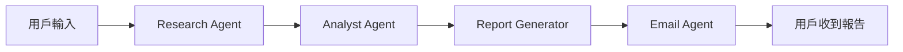

# 🌏 東南亞金融新聞智能搜尋與報告系統

一個基於 Agno 框架的 End-to-End 自動化工作流系統，專門用於搜尋、分析和分發東南亞金融新聞。

## 📋 功能特色

- 🔍 **智能搜尋**: 使用 ChatGPT mini-deep-research 進行深度網路搜尋
- 📊 **自動分析**: 將搜尋結果結構化並整理成專業報告
- 📄 **PDF 生成**: 自動生成格式優美的繁體中文 PDF 報告
- 📧 **郵件寄送**: 透過 MCP Email 自動發送報告至指定郵箱

## 🏗️ 技術架構

### 核心技術棧
- **框架**: [Agno](https://github.com/agno-agi/agno) - Multi-Agent System Runtime
- **語言**: Python 3.11+
- **套件管理**: UV
- **前端**: Streamlit
- **PDF 生成**: WeasyPrint
- **郵件服務**: SMTP (Gmail)

### Agent 架構
```
SEANewsWorkflow
├── ResearchAgent        # 搜尋代理
├── AnalystAgent         # 分析代理
├── ReportGeneratorAgent # 報告生成代理
└── EmailAgent           # 郵件代理
```

## 🚀 快速開始

### 前置需求
- Python 3.11 或更高版本
- UV 套件管理工具

### 安裝步驟

1. **克隆專案**（如果適用）
```bash
cd NewSeaNews
```

2. **安裝 UV**（如果尚未安裝）
```bash
# Windows (PowerShell)
powershell -c "irm https://astral.sh/uv/install.ps1 | iex"

# macOS/Linux
curl -LsSf https://astral.sh/uv/install.sh | sh
```

3. **建立虛擬環境並安裝依賴**
```bash
uv venv
.venv\Scripts\activate  # Windows
# source .venv/bin/activate  # macOS/Linux

uv pip install -e .
```

4. **配置環境變數**

`.env` 檔案已包含必要的配置，請確認內容正確：
```env
OPENAI_API_KEY=your_openai_api_key
SMTP_SERVER=smtp.gmail.com
SMTP_PORT=587
EMAIL_ADDRESS=your_email@gmail.com
EMAIL_PASSWORD=your_app_password
```

5. **驗證系統**
```bash
python main.py validate
```

## 💻 使用方式

### 方式 1: Web 介面（推薦）

啟動 Streamlit Web 應用：
```bash
streamlit run app.py
```

然後在瀏覽器中打開 `http://localhost:8501`

**使用流程**:
1. 在搜尋框輸入查詢主題（例如：新加坡金融科技趨勢）
2. 輸入收件人郵箱（支援多個郵箱，用逗號分隔）
3. 點擊「開始搜尋並寄送報告」按鈕
4. 系統會自動執行所有步驟並顯示進度
5. 完成後，PDF 報告會自動發送至指定郵箱

### 方式 2: 命令列介面

```bash
python main.py cli -q "新加坡股市最新動態" -e "recipient@example.com"
```

## 📁 專案結構

```
NewSeaNews/
├── agents/                 # Agent 模組
│   ├── __init__.py
│   ├── research_agent.py   # 搜尋代理
│   ├── analyst_agent.py    # 分析代理
│   ├── report_agent.py     # 報告生成代理
│   └── email_agent.py      # 郵件代理
├── reports/                # 生成的 PDF 報告
├── templates/              # 報告模板
├── tests/                  # 測試檔案
├── app.py                  # Streamlit Web 應用
├── workflow.py             # 工作流程編排
├── config.py               # 配置管理
├── main.py                 # 主程式入口
├── .env                    # 環境變數
├── .gitignore             # Git 忽略檔案
├── pyproject.toml         # 專案配置
├── PRD.md                 # 產品需求文件
└── README.md              # 專案說明
```

## 🎯 工作流程



### 詳細步驟

1. **Web Search (ResearchAgent)**
   - 使用 ChatGPT 和 DuckDuckGo 進行深度搜尋
   - 收集 5-10 條高質量新聞
   - 記錄來源和網址

2. **資訊結構化 (AnalystAgent)**
   - 整理搜尋結果
   - 生成 Markdown 格式報告
   - 附加資料來源超連結
   - 繁體中文輸出

3. **生成 PDF (ReportGeneratorAgent)**
   - 將 Markdown 轉換為 PDF
   - 應用專業排版樣式
   - 支援中文字體

4. **發送郵件 (EmailAgent)**
   - 使用 SMTP 服務
   - 附加 PDF 報告
   - 專業郵件模板

## 🎨 BMAD 團隊分工

本專案採用 **BMAD (Business, Marketing, Analytics, Development)** 團隊設定：

- **Business (業務)**: 定義產品願景和用戶需求
- **Marketing (市場)**: 目標用戶分析和推廣策略
- **Analytics (分析)**: 數據追蹤和性能監控
- **Development (開發)**: 系統架構和技術實現

## 🔧 開發指南

### 測試單個 Agent

```python
# 測試 Research Agent
python agents/research_agent.py

# 測試 Analyst Agent
python agents/analyst_agent.py

# 測試 Report Agent
python agents/report_agent.py

# 測試 Email Agent
python agents/email_agent.py
```

### 添加新功能

1. 在對應的 Agent 模組中添加功能
2. 更新 `workflow.py` 中的工作流程
3. 測試並驗證
4. 更新文檔

## 🚢 部署方案

### Docker 部署

```dockerfile
# Dockerfile
FROM python:3.11-slim

WORKDIR /app

COPY . .

RUN pip install uv && uv pip install -e .

EXPOSE 8501

CMD ["streamlit", "run", "app.py"]
```

構建並運行：
```bash
docker build -t seanews-system .
docker run -p 8501:8501 --env-file .env seanews-system
```

### 雲端部署選項

- **Google Cloud Run**: Serverless, 自動擴展
- **AWS ECS**: 彈性容器服務
- **Azure Container Instances**: 簡單快速部署

## 📊 性能指標

- 單次搜尋處理時間: < 2 分鐘
- PDF 生成時間: < 10 秒
- 郵件發送時間: < 5 秒
- 系統可用性: 99%

## 🔐 安全性

- API Key 使用 `.env` 檔案管理
- `.env` 已加入 `.gitignore`
- HTTPS 加密傳輸（生產環境）
- 郵件內容隱私保護

## 🐛 疑難排解

### 常見問題

**Q: OpenAI API 連接失敗？**
A: 檢查 `.env` 中的 `OPENAI_API_KEY` 是否正確，確保 API 端點一致。

**Q: 郵件發送失敗？**
A: 如果使用 Gmail，需要啟用「應用程式密碼」，不能使用普通密碼。

**Q: PDF 中文顯示問題？**
A: WeasyPrint 會自動處理中文字體，確保系統已安裝中文字體。

**Q: Agent 初始化很慢？**
A: 首次運行時需要下載模型，後續會快很多。

## 📝 更新日誌

### v1.0.0 (2025-01)
- ✨ 初始版本發布
- 🔍 實現 ChatGPT 深度搜尋
- 📊 自動化報告生成
- 📧 郵件自動發送
- 🎨 Streamlit Web 介面

## 📄 授權

本專案為內部使用專案。

## 🤝 貢獻

歡迎提交 Issue 和 Pull Request！

## 📞 聯絡方式

如有問題或建議，請聯絡開發團隊。

---

**Powered by Agno & OpenAI** | Built with ❤️ for SEA Financial News
